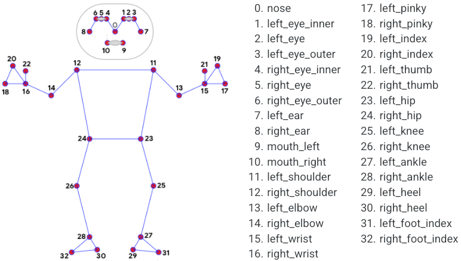

# 开发文档

## 控制面板
位于主页面左侧，用于用户的交互控制

## 画面
输入和输出的界面在画面中间和右侧，可以控制显示和取消
## 图表
主界面底部放置图表
### 频率的计算
要计算视频中或摄像头捕捉到的特定关键点在一定时间内的震动频率，需要考虑两个主要问题：如何跟踪和分析关键点的位置变化，以及如何处理视频播放的间断性。

在更新关键点的时候，在keypointPositions记录下当时的时间戳。
指定index，将keypointPositions对应的关键点取出到临时变量中，将其y值取出，应用function gaussianSmooth(dataY, sigma = 2)来平滑数据后写回临时变量，找出y值极大值并根据时间戳计算时间间隔，从而可以得到该点震动频率。

但是这是一种理想的情况，实际上仍存在一定的隐患：处理的帧率和输入的帧率往往是不同的，这对于实际频率的计算是有一定影响的。
例如，输入已经推送了50帧，但与此同时只有30帧被处理完毕并记录，计时器会将实际完成50帧的时间当作是30帧的，这样得到的时间有误差，频率也就不准确。
为了解决这个问题，需要添加一个全局变量来跟踪当前的帧数，并且在更新关键点时记录下这组关键点对应的帧在输入时的帧数和时间戳。解决起来有较大的难度，暂时认为视频处理的延迟忽略不计。

另外，对于视频文件，记录的时间戳应该是视频文件的时间位置，不应受视频播放控件的影响（暂停和调进度条）。实际上在视频文件被上传后，每一时刻的处理结果已经固定。对这点暂不关心，将视频同等处理。

## pose关键点的坐标

#### The 33 pose landmarks.
* NOSE = 0
* LEFT_EYE_INNER = 1
* LEFT_EYE = 2
* LEFT_EYE_OUTER = 3
* RIGHT_EYE_INNER = 4
* RIGHT_EYE = 5
* RIGHT_EYE_OUTER = 6
* LEFT_EAR = 7
* RIGHT_EAR = 8
* MOUTH_LEFT = 9
* MOUTH_RIGHT = 10
* LEFT_SHOULDER = 11
* RIGHT_SHOULDER = 12
* LEFT_ELBOW = 13
* RIGHT_ELBOW = 14
* LEFT_WRIST = 15
* RIGHT_WRIST = 16
* LEFT_PINKY = 17
* RIGHT_PINKY = 18
* LEFT_INDEX = 19
* RIGHT_INDEX = 20
* LEFT_THUMB = 21
* RIGHT_THUMB = 22
* LEFT_HIP = 23
* RIGHT_HIP = 24
* LEFT_KNEE = 25
* RIGHT_KNEE = 26
* LEFT_ANKLE = 27
* RIGHT_ANKLE = 28
* LEFT_HEEL = 29
* RIGHT_HEEL = 30
* LEFT_FOOT_INDEX = 31
* RIGHT_FOOT_INDEX = 32

# 注意事项
#### pose模型的稳定性：
1. 影响较小的因素：模型文件的选择、识别可信度的上下限
2. 影响**明显**的因素：输入、输出画面的大小应当与真实的大小比例相当，才能保证关键点的生成位置正确、多帧之间的波动稳定，也可以设置关键点smooth，使用mediapipe自带的方法使得关键点初步过滤
